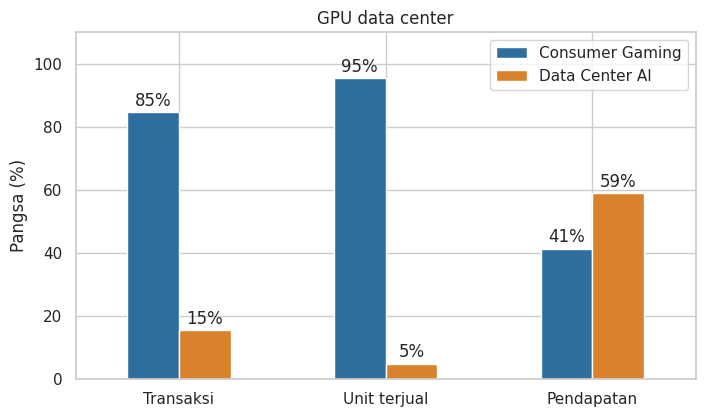
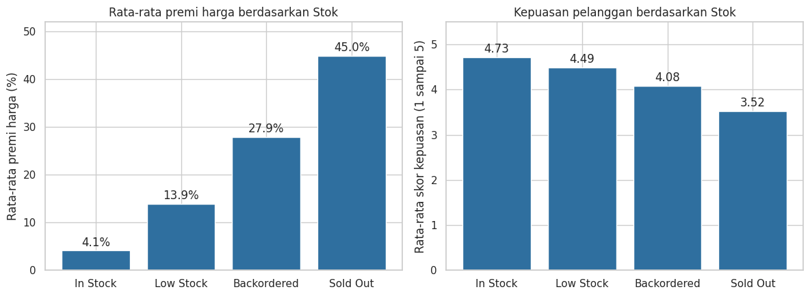

# Analisis Penjualan GPU Nvidia (EDA)

Analisis eksplorasi atas 7.000 transaksi penjualan GPU Nvidia, Januari 2024 sampai Juni 2026. Saya ingin tahu dari mana pendapatan datang, bagaimana trennya dari bulan ke bulan, dan apa hubungan status stok dengan harga jual dan kepuasan pelanggan.

Datanya sintetis (hasil simulasi, bukan data perusahaan), jadi proyek ini adalah latihan EDA, bukan kesimpulan tentang pasar Nvidia yang sebenarnya.

## Pertanyaan

1. Jenis GPU, model, channel, dan wilayah mana yang menyumbang pendapatan terbesar?
2. Bagaimana tren pendapatan per bulan?
3. Apa kaitan status stok dengan harga jual dan kepuasan pelanggan?

## Temuan utama

- GPU data center hanya 15% dari transaksi dan 5% dari unit, tetapi menyumbang 59% pendapatan.
- Dua channel enterprise (Cloud Provider dan Direct Enterprise) hanya 13% transaksi, tetapi sekitar 50% pendapatan.
- Pendapatan bulanan naik sampai akhir 2025 (kisaran US$23 sampai 28 juta per bulan), lalu mendatar.
- Makin langka stoknya, makin tinggi harga di atas MSRP: sekitar 4% untuk In Stock dan 45% untuk Sold Out. Skor kepuasan turun dari 4,73 ke 3,52.




Chart lengkap ada di folder `images/` dan di dalam notebook.

## Data

- Sumber: Nvidia GPU Sales Data 2026 di Kaggle (data sintetis). Link: https://www.kaggle.com/datasets/uditjain13/nvidia-gpu-sales-synthetic-2026
- 7.000 baris, 17 kolom, periode 12 Januari 2024 sampai 29 Juni 2026.
- Satu baris adalah satu transaksi: model GPU, wilayah, channel, segmen pelanggan, jumlah unit, harga, status stok, skor kepuasan, dan pendapatan.


## Cara menjalankan

```bash
git clone https://github.com/USERNAME/nvidia-gpu-sales-eda.git
cd nvidia-gpu-sales-eda
pip install -r requirements.txt
jupyter notebook EDA_Penjualan_GPU_Nvidia.ipynb
```

Bisa juga dibuka di Google Colab: upload notebook dan CSV ke sesi Colab, lalu pilih Runtime, Run all.

Output chart sudah tersimpan di notebook, jadi hasilnya bisa dibaca langsung di GitHub tanpa dijalankan.

## Isi repo

```
nvidia-gpu-sales-eda/
├── EDA_Penjualan_GPU_Nvidia.ipynb   notebook analisis
├── images/                          chart hasil analisis
├── requirements.txt
└── README.md
```

## Keterbatasan

- Datanya sintetis. Beberapa pola menunjukkan data dibuat dengan aturan, misalnya jumlah unit per transaksi tidak berubah walau stok langka, dan Retail/Etail hanya menjual GPU konsumen.
- Tidak ada data biaya atau margin, jadi tidak bisa dipastikan model mana yang paling menguntungkan.
- Pendapatan add-on tidak tercatat terpisah.
- Penjualan Juni 2026 lebih rendah dari bulan sebelumnya, tetapi belum bisa dipastikan apakah itu penurunan nyata atau data yang belum lengkap.
